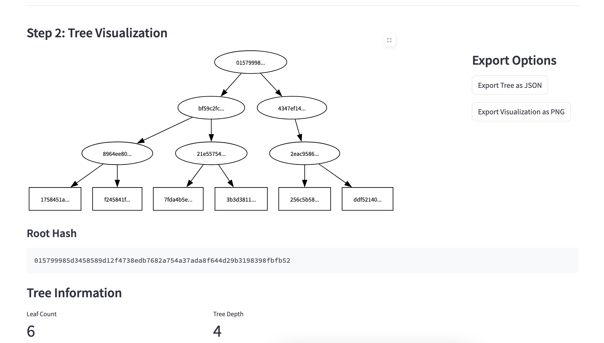
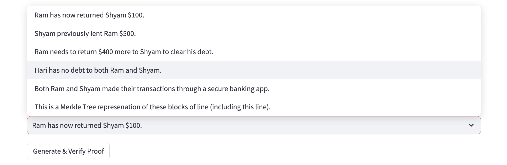

# Merkle Tree Visualizer

A user-friendly, interactive web application for creating, visualizing, and verifying Merkle trees with cryptographic proof capabilities and graphical representation.

## Table of Contents
- [Project Description](#project-description)
- [Installation](#installation)
- [Usage](#usage)
- [Features](#features)
- [Methodology](#methodology)
- [Examples](#examples)
- [References](#references)
- [Dependencies](#dependencies)
- [Algorithms/Mathematical Concepts Used](#algorithmsmathematical-concepts-used)
- [License](#license)
- [Acknowledgments](#acknowledgments)
- [Note](#note)

## Project Description

The Merkle Tree Visualizer is an interactive web application built with Streamlit that allows users to construct Merkle trees from arbitrary data inputs, visualize the resulting tree structure, generate cryptographic proofs of inclusion, and verify these proofs. Merkle trees are fundamental data structures in cryptography and blockchain technology, providing an efficient way to verify the integrity of data in distributed systems.

This application serves multiple purposes:

1. **Educational Tool**: Helps users understand the underlying principles of Merkle trees through visualization and interaction
2. **Development Utility**: Assists developers in testing and verifying Merkle tree implementations
3. **Cryptographic Verification**: Demonstrates the process of generating and verifying inclusion proofs
4. **Blockchain Concept Exploration**: Illustrates one of the core data structures that make blockchain technology possible

At its core, the application implements a complete Merkle tree with SHA-256 hashing, proper handling of odd-numbered node layers, comprehensive proof generation and verification, and an intuitive visualization system that makes complex cryptographic concepts accessible.

## Installation

Follow these steps to set up the Merkle Tree Visualizer locally:

1. Install the required dependencies:
   ```bash
   pip install streamlit hashlib graphviz
   ```

2. Ensure you have Graphviz installed on your system:
   - On Ubuntu/Debian: `sudo apt-get install graphviz`
   - On macOS: `brew install graphviz`
   - On Windows: Download and install from [graphviz.org](https://graphviz.org/download/)

## Usage

1. **Data Input**:
   - In the "Step 1: Input Data and Build Tree" section, enter your data blocks in the text area
   - Each line will be treated as a separate data block (leaf node)
   - Click "Build/Update Merkle Tree" to generate the tree structure

2. **Tree Visualization**:
   - The "Step 2: Tree Visualization" section will display the generated Merkle tree
   - The root hash is shown at the top, with child nodes branching downward
   - Each node displays a truncated version of its hash value
   - Examine the tree structure to understand how leaf data hashes combine to form the root

3. **Tree Information**:
   - View key metrics about your tree, including:
     - Total leaf count
     - Tree depth (number of layers)
     - Complete root hash value

4. **Proof Generation and Verification**:
   - In the "Step 3: Proof Verification" section, select a data item from the dropdown
   - Click "Generate & Verify Proof" to:
     - Create a cryptographic proof for the selected data
     - View the proof details (sibling hashes and path indices)
     - Automatically verify the proof against the root hash

5. **Exporting Data**:
   - Use the export options to:
     - Download the complete tree data as a JSON file
     - Export the tree visualization as a PNG image for documentation or sharing

### Advanced Usage

- **Large Data Sets**: The application can handle large data sets (up to 1000 leaves by default), but performance may decrease with very large trees
- **Custom Hash Functions**: The code uses SHA-256 by default but can be modified to use other hash functions from the hashlib library
- **Proof Manipulation**: Advanced users can extract and use the proof data for external verification systems

## Features

### Core Functionality

- **Dynamic Merkle Tree Construction**: Creates a complete binary hash tree from arbitrary input data using SHA-256 cryptographic hashing
- **Interactive Data Management**: Allows users to input, modify, and update data blocks with immediate tree reconstruction
- **Comprehensive Tree Visualization**: Renders the entire tree structure with clear parent-child relationships and hash value labels
- **Performance Optimizations**: Implements hash caching to improve performance when rebuilding or modifying trees
- **Proper Odd Node Handling**: Correctly duplicates the last node when dealing with odd-numbered layers (a critical aspect of Merkle tree implementation)

### Cryptographic Features

- **Inclusion Proof Generation**: Creates cryptographic proofs that demonstrate a specific data block is part of the tree without revealing the entire dataset
- **Path Verification**: Verifies inclusion proofs by recomputing the root hash from a data block using the provided sibling hashes and path indices
- **Secure Hashing**: Utilizes SHA-256 for all cryptographic operations, ensuring cryptographic security

### User Interface

- **Progress Tracking**: Provides visual feedback during tree construction with progress bars and status messages
- **Interactive Tree Exploration**: Allows users to inspect the tree structure through the graphical visualization
- **Proof Verification Interface**: Offers a user-friendly interface for selecting data and generating/verifying proofs
- **Expandable Sections**: Organizes functionality into logical, collapsible sections for a clean user experience
- **Data Export Options**: Enables exporting of tree data as JSON and visualizations as PNG files

### Technical Features

- **Memory-Efficient Design**: Uses hash caching to avoid redundant computations
- **Type Annotations**: Includes Python type hints for improved code readability and IDE support
- **Modular Architecture**: Separates core logic, visualization, and UI components for maintainability
- **Large Tree Support**: Capable of handling trees with numerous leaf nodes (with appropriate warnings for performance considerations)

## Methodology

The application implements Merkle trees following a systematic approach that combines cryptographic principles with efficient data structures and visualization techniques:

### 1. Data Processing and Preparation

- **Input Parsing**: Raw user input is split into individual data blocks, with each line becoming a separate leaf node
- **Data Validation**: Empty lines are filtered out to ensure all leaf nodes contain valid data
- **Block Preparation**: Each data block is prepared for hashing in its raw text form

### 2. Tree Construction Algorithm

- **Leaf Node Creation**:
  - Each data block is hashed using SHA-256 to create the leaf layer (bottom layer) of the tree
  - These leaf hashes form the foundational layer upon which the tree is built

- **Intermediate Layer Construction**:
  - Starting from the leaf layer, the algorithm works upward (bottom-up approach)
  - For each layer:
    - If the layer has an odd number of nodes, the last node is duplicated
    - Adjacent pairs of nodes are combined and hashed together
    - The resulting hashes form the next layer up in the tree
  - This process continues recursively until reaching a single root hash

- **Hash Combination Method**:
  - When combining two child nodes, their hash values are concatenated as strings
  - The concatenated string is then hashed with SHA-256
  - This approach ensures that the order of children matters (`hash(A+B) ≠ hash(B+A)`)

- **Root Calculation**:
  - The process terminates when a layer with exactly one node is created
  - This single node becomes the Merkle root, representing a cryptographic summary of all data

### 3. Proof Generation Methodology

- **Path Determination**:
  - For a selected leaf node, the algorithm traces its path to the root
  - At each level, it records:
    - The sibling node's hash (the node paired with the current node)
    - A path index indicating whether the current node is a left (0) or right (1) child

- **Sibling Collection**:
  - The algorithm collects all sibling hashes encountered along the path
  - For the last node in an odd-numbered layer, the node's own hash is used as its sibling

- **Proof Data Structure**:
  - The complete proof consists of:
    - An ordered list of sibling hashes
    - Corresponding path indices indicating the position (left/right) of each node relative to its sibling

### 4. Proof Verification Process

- **Hash Recomputation**:
  - Starting with the original data block, its hash is calculated
  - For each level, the algorithm:
    - Combines the current hash with the corresponding sibling hash
    - The combination order depends on the path index (current+sibling for left nodes, sibling+current for right nodes)
    - The combined value is hashed to produce the parent hash
  - This process continues until reaching a final hash value

- **Root Comparison**:
  - The final computed hash is compared to the stored root hash
  - If they match exactly, the proof is valid, confirming the data block's inclusion in the tree
  - Any mismatch indicates either data corruption or that the block is not part of the tree

### 5. Visualization Technique

- **Graph Construction**:
  - A directed graph is created using Graphviz
  - Each node in the Merkle tree becomes a vertex in the graph
  - Parent-child relationships are represented as directed edges

- **Node Representation**:
  - Each node displays a truncated version of its hash for readability
  - The root and intermediate nodes use oval shapes
  - Leaf nodes use rectangular shapes to distinguish them visually

- **Layer Organization**:
  - The graph is arranged top-to-bottom with the root at the top
  - Nodes at the same level in the tree are positioned at the same rank in the visualization
  - This hierarchical layout clearly illustrates the tree structure

## Examples

### Basic Example: Simple Four-Transaction Block

**Input Data:**
```
Alice pays Bob 5 BTC
Bob pays Charlie 1 BTC
Charlie pays Dave 0.5 BTC
Dave pays Alice 1.5 BTC
```

**Expected Outcome:**
1. Four leaf nodes will be created with the SHA-256 hashes of each transaction
2. Two intermediate nodes will be created from pairs of leaf hashes
3. One root node will be created from the two intermediate nodes
4. The visualization will show a tree with three layers (root, intermediate, leaves)

**Verification Example:**
1. Select "Alice pays Bob 5 BTC" from the dropdown
2. Click "Generate & Verify Proof"
3. The proof will show:
   - The sibling hash (hash of "Bob pays Charlie 1 BTC")
   - The path indices [0] (indicating it's a left child)
   - The next-level sibling hash needed to reach the root
   - Verification status: VALID

### Advanced Example: Odd-Numbered Leaves

**Input Data:**
```
Transaction 1
Transaction 2
Transaction 3
Transaction 4
Transaction 5
```

**Tree Structure Handling:**
1. Five leaf nodes are created from the transaction data
2. Since 5 is odd, the last leaf node is duplicated, creating a virtual 6th node
3. Three intermediate nodes are created in the next layer up
4. Since 3 is odd, the last intermediate node is duplicated
5. Two nodes are created in the next layer
6. Finally, these combine to form the root hash

This example demonstrates how the algorithm correctly handles odd numbers of nodes at each layer, ensuring the tree remains balanced and complete.

| *Sample Step 1: Input Data and Build Tree* |
|:--:| 
|  |

| *Sample Step 2: Tree Visualization* |
|:--:| 
|  |

| *Sample Step 3.0: Proof Verification* |
|:--:| 
|  |

| *Sample Step 3.1: Selecting Block to verify* |
|:--:| 
|  |

| *Sample Step 3.2: Block Selected* |
|:--:| 
|  |

| *Sample Step 3.3: Validity of proof* |
|:--:| 
|  |

## References

1. Merkle, R. C. (1987). "A Digital Signature Based on a Conventional Encryption Function." *Advances in Cryptology — CRYPTO '87*. Lecture Notes in Computer Science, 293, 369-378. https://doi.org/10.1007/3-540-48184-2_32

   This foundational paper by Ralph Merkle introduced the concept of hash trees (now known as Merkle trees) and their application to digital signatures.

2. Narayanan, A., Bonneau, J., Felten, E., Miller, A., & Goldfeder, S. (2016). "Bitcoin and Cryptocurrency Technologies: A Comprehensive Introduction." Princeton University Press, 177-182.

   This comprehensive textbook provides an in-depth explanation of Merkle trees as used in Bitcoin and other cryptocurrencies.

3. Nakamoto, S. (2008). "Bitcoin: A Peer-to-Peer Electronic Cash System." *Bitcoin.org*.
   https://bitcoin.org/bitcoin.pdf

   The original Bitcoin whitepaper describes the use of Merkle trees for efficient verification of transactions in blocks.

4. Crosby, S. A., & Wallach, D. S. (2009). "Efficient Data Structures for Tamper-Evident Logging." *18th USENIX Security Symposium*, 317-334.

   This paper explores the use of Merkle trees for tamper-evident logging systems, including performance considerations.

5. Becker, G. (2008). "Merkle Signature Schemes, Merkle Trees and Their Cryptanalysis." *Seminar in Cryptography*, Ruhr-Universität Bochum.

   A comprehensive seminar paper that discusses Merkle trees, their cryptographic properties, and potential vulnerabilities.

6. Szydlo, M. (2004). "Merkle Tree Traversal in Log Space and Time." *Advances in Cryptology - EUROCRYPT 2004*, Lecture Notes in Computer Science, 3027, 541-554.

   This paper presents efficient algorithms for Merkle tree traversal, which are relevant to proof generation and verification.

## Dependencies

- **streamlit**: Web application framework
- **hashlib**: Cryptographic hash function library
- **graphviz**: Graph visualization tools
- **json**: JSON handling for data export
- **time**: Time-related functions
- **os**: Operating system interfaces
- **typing**: Type hints support
- **dataclasses**: Data class decorators

## Algorithms/Mathematical Concepts Used

### Merkle Tree Structure and Properties

Merkle trees are binary trees where:

- **Leaves**: L = {h(d₁), h(d₂), ..., h(dₙ)} where h is a cryptographic hash function and dᵢ are data blocks
- **Internal Nodes**: Each internal node value v = h(v_left + v_right) where v_left and v_right are its child nodes
- **Root**: The single node at the top level, representing a digest of all data in the tree

The mathematical properties that make Merkle trees valuable include:

1. **Collision Resistance**: Due to the cryptographic hash function properties, finding two different inputs that produce the same hash (and thus the same root) is computationally infeasible

2. **Tree Height**: For n leaf nodes, the tree height is ⌈log₂(n)⌉ + 1, ensuring logarithmic proof size

3. **Proof Size**: An inclusion proof requires only log₂(n) sibling hashes, making verification efficient even for large datasets

4. **Change Propagation**: Any change to a leaf node propagates up to the root, changing all nodes along the path and ultimately the root itself

### SHA-256 Cryptographic Hash Function

The application uses SHA-256 (Secure Hash Algorithm 256-bit), which has the following properties:

1. **Fixed Output Size**: Produces a 256-bit (32-byte) hash value regardless of input size

2. **Deterministic**: The same input always produces the same output

3. **Pre-image Resistance**: Given a hash value h, it's computationally infeasible to find any message m such that h = hash(m)

4. **Second Pre-image Resistance**: Given an input m₁, it's computationally infeasible to find another input m₂ ≠ m₁ such that hash(m₁) = hash(m₂)

5. **Collision Resistance**: It's computationally infeasible to find any two different inputs m₁ and m₂ such that hash(m₁) = hash(m₂)

6. **Avalanche Effect**: A small change in the input produces a significantly different output (approximately 50% of the bits change)

The SHA-256 algorithm works by:
- Breaking the input into 512-bit blocks
- Initializing an internal state with specific constants
- Processing each block through a compression function with 64 rounds of operations
- Producing a final 256-bit digest

### Proof Generation and Verification Algorithms

#### Inclusion Proof Generation Algorithm

For a leaf node at index i:

1. Initialize empty lists for siblings and path indices
2. Start at the leaf layer and the target index i
3. For each layer from bottom to top:
   - Determine if current node is a left (even index) or right (odd index) child
   - Record this as the path index (0 for left, 1 for right)
   - Compute the sibling index:
     - If left child: sibling_index = current_index + 1
     - If right child: sibling_index = current_index - 1
   - Add the hash at sibling_index to the siblings list
   - Update current_index = ⌊current_index/2⌋ for the next layer
4. Return the siblings list and path indices list as the proof

#### Proof Verification Algorithm

Given a data block, a list of sibling hashes [s₁, s₂, ..., sₖ], and path indices [p₁, p₂, ..., pₖ]:

1. Compute the leaf hash h₀ = hash(data)
2. For i from 1 to k:
   - If pᵢ = 0 (left child): hᵢ = hash(hᵢ₋₁ + sᵢ)
   - If pᵢ = 1 (right child): hᵢ = hash(sᵢ + hᵢ₋₁)
3. Compare hₖ to the stored root hash
4. If they match, the proof is valid; otherwise, it's invalid

This algorithm has O(log n) time complexity for a tree with n leaves.

### Tree Balance Algorithm for Odd-Numbered Layers

To maintain a complete binary tree structure:

1. At each layer, check if the number of nodes is odd (|N| % 2 == 1)
2. If odd, duplicate the last node: N = N ∪ {N[|N|-1]}
3. This ensures that each parent has exactly two children
4. The duplication propagates upward if necessary

This approach simplifies tree operations while maintaining the cryptographic integrity of the structure.

## License

This project is licensed under the MIT License - see the LICENSE file for details.

## Acknowledgments

- **Cryptographic Foundations**: This project builds upon the foundational work of Ralph Merkle and the cryptographic research community
- **Blockchain Technology**: Inspired by the practical applications of Merkle trees in Bitcoin and other blockchain systems
- **Open Source Libraries**: Special thanks to the developers of Streamlit and Graphviz for creating powerful tools that make this visualization possible
- **Academic Resources**: Thanks to the authors of the papers and books cited in the References section for their valuable contributions to the field
- **Streamlit Community**: For their continuous support and feedback on data visualization applications
- **Contributor Community**: All individuals who have contributed code, suggestions, and issue reports

## Note
| AI was used to generate most of the docstrings and inline comments in the code. |
|:--:|
